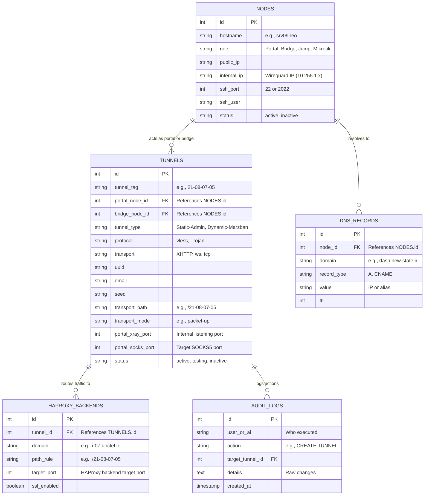

# Centralized Config Management System (CCMS) for IDN

This document proposes a unified database and orchestration architecture to transition the Internet Delivery Network (IDN) from fragile, manual, file-based edits to a robust, automated, **Single Source of Truth**.

---

## 1. The Core Problem & The Solution

Currently, managing the IDN involves manually SSHing into servers, writing JSON files for Xray, tweaking HAProxy configs on Server 07, creating DNS zones in Technitium, and generating keys. 
*   **The Fragility**: A single typo in an Xray JSON or HAProxy backend will crash the service. More critically, an accidental touch to the **Zero-Touch Management Tunnels** can lock both the admin and the AI out of the network permanently.
*   **The Solution**: A **Centralized Config Database (MySQL)** on Server 07 that acts as the single source of truth, combined with an automated, templated config compiler and validator.

---

## 2. Architectural Topology

```mermaid
graph TD
    subgraph Server 07 (Orchestrator Gateway)
        DB[(MySQL: idn_orchestrator)]
        CLI[idn-ctl CLI Tool]
        Templates[Jinja2 Templates]
        HAProxy[HAProxy]
        Technitium[Technitium DNS]
    end

    subgraph Internal Nodes (Iran)
        srv01[srv01 Portal]
        srv03[srv03 Portal]
        srv04[srv04 Shiraz]
    end

    subgraph External Bridges (Global)
        srv08[srv08 Germany]
        srv09[srv09 US Bridge]
        srv10[srv10 Germany]
    end

    DB -->|Read State| CLI
    Templates -->|Render Configs| CLI
    CLI -->|Local Reload & Test| HAProxy
    CLI -->|API/DNS Update| Technitium
    CLI -->|Push & SSH Reload via Port 22| srv01
    CLI -->|Push & SSH Reload via Port 22| srv03
    CLI -->|Push & SSH Reload via Port 2022| srv08
    CLI -->|Push & SSH Reload via Port 2022| srv09
    CLI -->|Push & SSH Reload via Port 2022| srv10
```

---

## 3. Relational Database Schema Design (MySQL)

Since **Server 07** already runs a robust, native MySQL server, we can leverage it directly to host a new schema called `idn_orchestrator`. This keeps the infrastructure lightweight and fast without adding external dependencies (like CouchDB or Consul) that consume memory on restricted nodes.

### Entity-Relationship Diagram (ERD)



---

## 4. SQL Table Definitions (MySQL Native DDL)

Here are the precise table structures that will store your configurations.

```sql
CREATE DATABASE IF NOT EXISTS idn_orchestrator;
USE idn_orchestrator;

-- 1. Nodes Inventory
CREATE TABLE nodes (
    id INT AUTO_INCREMENT PRIMARY KEY,
    hostname VARCHAR(100) NOT NULL UNIQUE,
    role ENUM('Portal', 'Bridge', 'Jump', 'Mikrotik', 'Gateway') NOT NULL,
    public_ip VARCHAR(45) NULL,
    internal_ip VARCHAR(45) NOT NULL UNIQUE, -- Wireguard/Tailscale 10.255.1.x IP
    ssh_port INT DEFAULT 22,                  -- Handles 2022 for external bridges
    ssh_user VARCHAR(50) DEFAULT 'merezarezaei',
    status ENUM('active', 'maintenance', 'inactive') DEFAULT 'active',
    created_at TIMESTAMP DEFAULT CURRENT_TIMESTAMP,
    updated_at TIMESTAMP DEFAULT CURRENT_TIMESTAMP ON UPDATE CURRENT_TIMESTAMP
);

-- 2. Xray Tunnels Definition
CREATE TABLE tunnels (
    id INT AUTO_INCREMENT PRIMARY KEY,
    tunnel_tag VARCHAR(100) NOT NULL UNIQUE,  -- E.g., '21-08-07-05'
    portal_node_id INT NOT NULL,
    bridge_node_id INT NOT NULL,
    tunnel_type ENUM('Static-Admin', 'Dynamic-Marzban') DEFAULT 'Dynamic-Marzban',
    protocol VARCHAR(20) DEFAULT 'vless',
    transport VARCHAR(20) DEFAULT 'XHTTP',
    uuid VARCHAR(64) NOT NULL,
    email VARCHAR(100) NOT NULL,
    seed VARCHAR(64) NOT NULL,
    transport_path VARCHAR(255) NOT NULL,
    transport_mode VARCHAR(20) DEFAULT 'packet-up',
    portal_xray_port INT NOT NULL,            -- e.g. 5011
    portal_socks_port INT NOT NULL,           -- e.g. 21081
    status ENUM('active', 'testing', 'inactive') DEFAULT 'inactive',
    created_at TIMESTAMP DEFAULT CURRENT_TIMESTAMP,
    updated_at TIMESTAMP DEFAULT CURRENT_TIMESTAMP ON UPDATE CURRENT_TIMESTAMP,
    FOREIGN KEY (portal_node_id) REFERENCES nodes(id),
    FOREIGN KEY (bridge_node_id) REFERENCES nodes(id),
    CONSTRAINT chk_ports CHECK (portal_xray_port != portal_socks_port)
);

-- 3. HAProxy Subdomain & Path Routing
CREATE TABLE haproxy_backends (
    id INT AUTO_INCREMENT PRIMARY KEY,
    tunnel_id INT NOT NULL,
    domain VARCHAR(255) NOT NULL,              -- e.g. 'i-07.doctel.ir'
    path_rule VARCHAR(255) NOT NULL,           -- e.g. '/21-08-07-05'
    target_port INT NOT NULL,                  -- Local port mapping (e.g. 5011)
    ssl_enabled BOOLEAN DEFAULT TRUE,
    created_at TIMESTAMP DEFAULT CURRENT_TIMESTAMP,
    FOREIGN KEY (tunnel_id) REFERENCES tunnels(id) ON DELETE CASCADE
);

-- 4. Centralized DNS Records (Syncs to Technitium)
CREATE TABLE dns_records (
    id INT AUTO_INCREMENT PRIMARY KEY,
    node_id INT NOT NULL,
    domain VARCHAR(255) NOT NULL UNIQUE,       -- e.g. 'panel.new-state.ir'
    record_type ENUM('A', 'CNAME', 'TXT') DEFAULT 'A',
    value VARCHAR(255) NOT NULL,               -- e.g. '185.204.197.242'
    ttl INT DEFAULT 3600,
    created_at TIMESTAMP DEFAULT CURRENT_TIMESTAMP,
    FOREIGN KEY (node_id) REFERENCES nodes(id)
);

-- 5. Audit Log (Absolute accountability for updates)
CREATE TABLE audit_logs (
    id INT AUTO_INCREMENT PRIMARY KEY,
    actor VARCHAR(100) NOT NULL,               -- e.g., 'Antigravity-AI' or 'merezarezaei'
    action_type VARCHAR(50) NOT NULL,          -- e.g., 'CREATE_TUNNEL', 'UPDATE_HAPROXY'
    target_id INT NULL,
    details TEXT NOT NULL,                     -- JSON-string representing changes
    created_at TIMESTAMP DEFAULT CURRENT_TIMESTAMP
);
```

---

## 5. The Dynamic Orchestration Engine

Using this relational store, the configurations on the target servers are no longer static files. They are generated via a lightweight python orchestrator script (`idn-ctl`) running on Server 07.

### A. Rendering Pipeline
1.  **Read Database**: `idn-ctl` fetches tunnel and node configuration data from the MySQL database.
2.  **Generate Templates**: It feeds the records to standard Jinja2 templates (located in the repository under `configs/templates/`):
    - `xray_portal.json.j2`
    - `xray_bridge.json.j2`
    - `haproxy.cfg.j2`
3.  **Compile File**: It generates the resulting files locally on Server 07.

### B. Safety Gate Check & Remote Push (No Lockouts)
Before the orchestrator activates a config, it executes the following safe steps automatically:

```
[1] Compile Local JSON
       │
       ▼
[2] Run Local Syntax Check (e.g. `xray -test -config /tmp/temp_config.json`)
       │
       ├─► (FAILED) ──► ABORT & Log Error (No disruption)
       │
       ▼ (PASSED)
[3] Copy config to target node via SCP (Port 22/2022) to a temp path
       │
       ▼
[4] Run remote validation command (e.g., SSH `xray -test -config /etc/xray/temp.json`)
       │
       ├─► (FAILED) ──► ABORT & Delete Temp File
       │
       ▼ (PASSED)
[5] Armed Auto-Rollback Active (Trigger 60-second recovery sleep daemon)
       │
       ▼
[6] Apply change (Symlink temp config to actual path & reload systemd service)
       │
       ▼
[7] Perform Automated Health SOCKS5 Dial Check
       │
       ├─► (SUCCESS) ──► Cancel Auto-Rollback Daemon ──► PASS
       │
       └─► (FAILED) ──► (Sleep 60s expires) ──► Revert symlink & reload ──► FAIL / REVERTED
```

---

## 6. Implementation Stages & Timeline

If you approve this plan, we can build it iteratively to ensure zero-downtime:

*   **Phase 1 (The DB & Local Templates)**: 
    *   Initialize the `idn_orchestrator` database in the native MySQL instance.
    *   Create standard, flexible Jinja2 template files in the repository.
    *   Populate the database with your current active nodes and tunnels (e.g. Server 08, 09, 10).
*   **Phase 2 (The `idn-ctl` CLI Agent)**:
    *   Write a clean python script (`idn-ctl`) on Server 07 that can:
        - `idn-ctl compile` -> compiles configs.
        - `idn-ctl deploy <tunnel_tag>` -> safely deploys the tunnel.
        - `idn-ctl status` -> checks SOCKS5 ports to verify which tunnels are alive.
*   **Phase 3 (Technitium & HAProxy Automation)**:
    *   Automate HAProxy reloads when `idn-ctl` detects new dynamic backends.
    *   Add Technitium API integration so when a new node is registered, its subdomain is automatically added/updated in the DNS Server over HTTP APIs.
*   **Phase 4 (Web Control Panel - Optional)**:
    *   Wrap `idn-ctl` with a gorgeous, responsive, responsive glassmorphism web interface (FastAPI backend + Tailwind/Vanilla CSS single-page client) so you can add tunnels, rotate UUIDs, and monitor bandwidth directly from your phone or browser.

---

### 🚨 Crucial Zero-Touch Invariant Protection
The compilation and rendering pipeline will **explicitly ignore and bypass** any nodes or configs associated with the three core management tunnels (`mmd-pg`, `mmd-pg-us`, `mmd-pg-de`). These static records will reside in a separate protected configuration file or database namespace to ensure they are **never** compiled or modified by automated tools.
